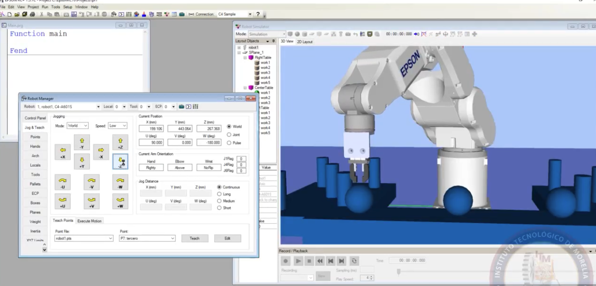

# Rubrica de trabajo

- Los equipos de laboratorio serán de 3 personas y puede ser unicamente una laptop con el programa por equipo
- El equipo deberá crear una organización en GitHub donde agreguen a todos los integrantes del equipo incluyendome donde crearán un repositorio por práctica en donde incluya lo siguiente:
  - Número de práctica
  - Integrantes del equipo
  - Documentación completa en el README.md
  - Códigos
  - Imagenes
  - Archivos utilizados
  - Referencias bibliográficas
    
A continuación un ejemplo de como debe ir la práctica:

# Práctica X
## Integrantes:
- Juan David López Regalado
- Nikola Tesla
- Marie Curie

## Introducción
Los movimientos **Move** y **Go** son 2 tipos de movimientos que tiene el robot Epson C4 que tienen por diferencia que uno ... y otro ... respectivamente, una manera facil de identificarlos es mediante [N]...

## Intrucciones
Primeramente se utilizó el simulador para comprobar que los movimientos son los correctos y no exista una colisión con el robot real que pudiera dañarlo es por eso que se usó el robot manager donde podemos modificar los puntos de donde queremos hacer el movimiento como se muestra en la imagen:



Posteriormente pasamos a programar el robot físico donde se colocaron los 2 puntos pero que se recorrieran de las 2 distintas maneras Go y Move, el codigo usado es el siguiente:

```
Function main
Motot on
Power Low
Speed 50
Accel 30, 30
SpeedS 800
AccelS 8000, 8000
Home
Go punto1
Home
Move punto1
Home
Fend
```

Con esto, el robot hace las 2 trayevctorias sin embargo toman 2 rutas ligeramente distintas debido a ...

## Conclusiones

**Juan David López Regalado:** No le entendí a la práctica...<br>
**Nikola Tesla:** Yo tampoco...<br>
**Marie Curie:** Los movimientos Move y Go tienen de diferencia ...<br>

## Referencias Bibliográficas

[1] Gruber, John. *Markdown: Syntax Documentation.* Daring Fireball, 2004, [https://daringfireball.net/projects/markdown/](https://daringfireball.net/projects/markdown/).

[2] MacFarlane, John. *Pandoc User’s Guide.* Pandoc, 2006, [https://pandoc.org/MANUAL.html](https://pandoc.org/MANUAL.html).

[3] Williams, Matthew, et al. *Mastering Markdown.* GitHub Guides, GitHub, [https://guides.github.com/features/mastering-markdown/](https://guides.github.com/features/mastering-markdown/).

